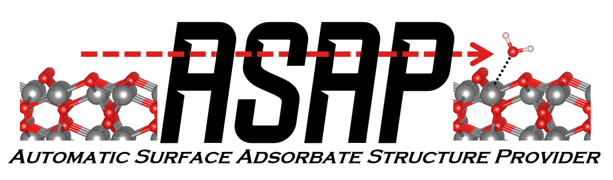

Associated Journal Artcile  -  https://www.sciencedirect.com/science/article/pii/S2210271X22002432

# Dependencies

- pymatgen v >= 2022.0.17 : Older versions of pymatgen have not been tested
- If you have pymatgen installed all other ASAP dependencies should also be isntalled. However, two dependecies you'll want to verify:
- python v >= 3.8
- sympy 

# Install

The current version of ASAP can be installed via pip:: 

    pip install ASAPy

Currently this instalation does NOT install the dependencies. Please ensure you have the above dependencies in place.

# Examples
Future examples will be presented here. As of now we have a downloadable python script that gives an example run through of implementing ASAP::
	
	run_asap.py

Please note the accompanying structure files (POSCAR & POSCAR_O2) will also need to be present in the directory that run_asap.py is located. 

